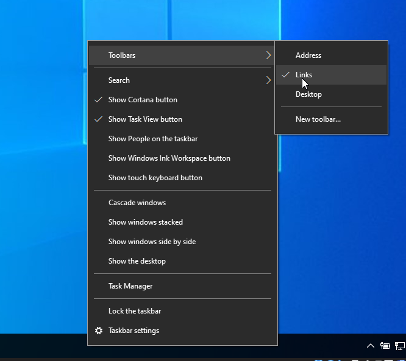
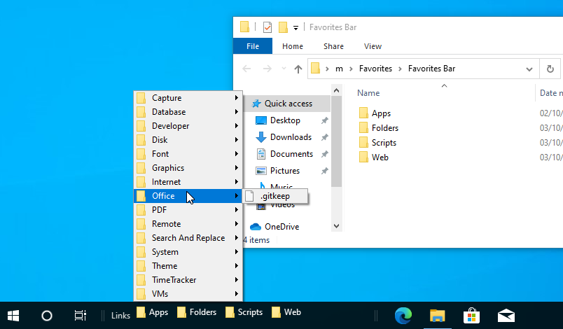

# windows10
- Windows 10 post install scripts

## Automated installation:

1. Go to this. link and check that it is installed and up to date:
https://apps.microsoft.com/store/detail/app-installer/9NBLGGH4NNS1

2. Open Powershell as Administrator and run the following command to install:
```
 wget -O "$HOME\Downloads\install.zip" https://github.com/martinandersen3d/windows10/archive/refs/heads/main.zip ; Expand-Archive -LiteralPath "$HOME\Downloads\install.zip" -DestinationPath "$HOME\Downloads\install" ; Set-ExecutionPolicy Bypass -Scope Process -Force; [System.Net.ServicePointManager]::SecurityProtocol = [System.Net.ServicePointManager]::SecurityProtocol -bor 3072; . "$HOME\Downloads\install\windows10-main\main.ps1"
```


## Manuel Install

https://www.google.com/chrome/

https://www.google.com/chrome/canary/

https://visualstudio.microsoft.com/downloads/

https://learn.microsoft.com/en-us/sql/ssms/download-sql-server-management-studio-ssms?view=sql-server-ver16

https://www.linqpad.net/Download.aspx

https://www.softwareok.com/?seite=Microsoft/QuickTextPaste


## Powershell Unrestricted

```
Set-ExecutionPolicy -Scope CurrentUser Unrestricted
```

## Git SSH Setup (for linux, but windows is almost the same with OpenSSH)
- TODO: Create a PowerShell version
https://github.com/martinandersen3d/github-ssh-key-setup

# Work in Progress

Makes it easy to setup fast navigation to important apps, folders and websites:



